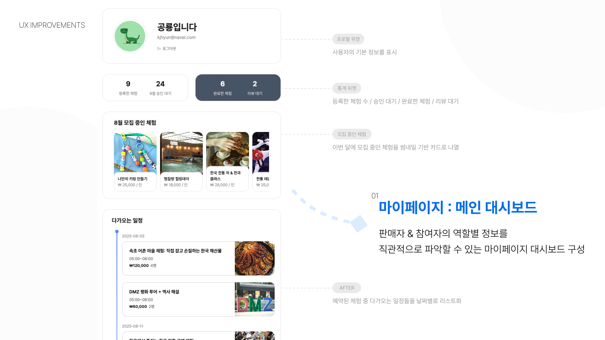
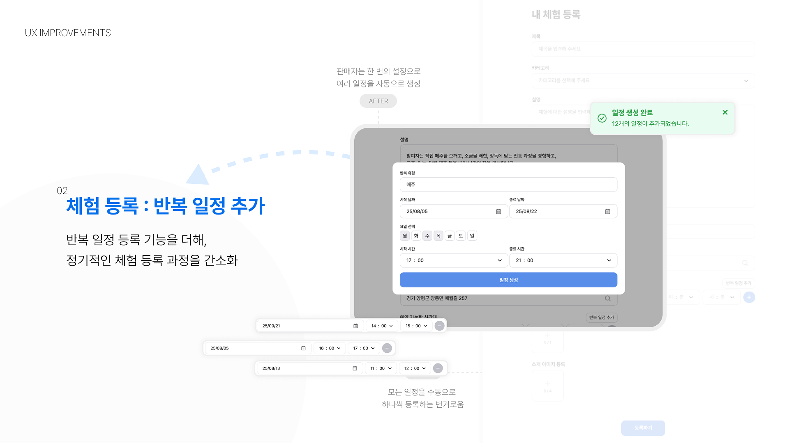
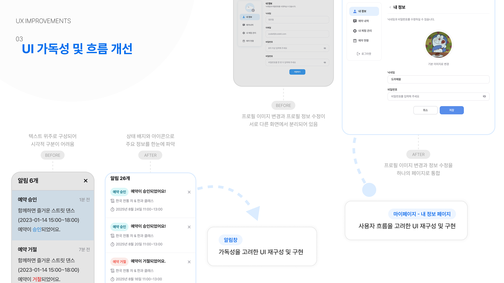
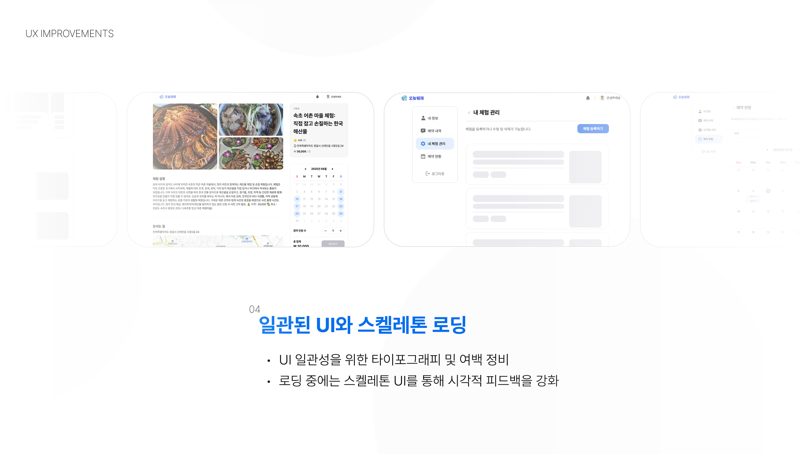
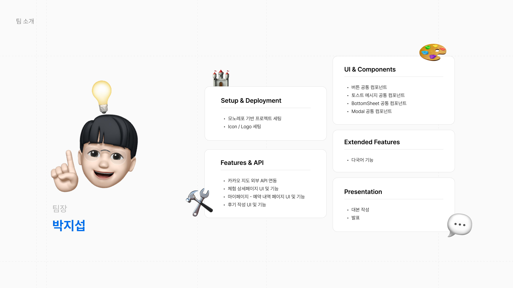
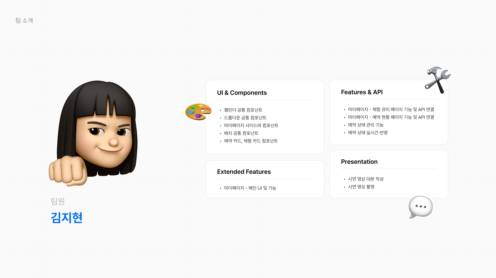

<div align="center" style="display:flex; align-items:center; justify-content:center;">
  
  <span style="font-size:40px; font-weight:bold; color:#6EC1E4;">오늘뭐해</span>
</div>

## 📖 프로젝트 소개

오늘뭐해 플랫폼은 체험 제공자(호스트)가 자신만의 체험 프로그램을 등록하고, 사용자(참여자)가 해당 체험을 예약·이용하며, 이용 후 후기\*를 남길 수 있는 글로벌 웹 서비스입니다.</br>  
🧑‍💼 호스트는 간단한 절차로 체험 정보를 등록·수정할 수 있으며,  
🙋‍♂️ 사용자는 다양한 카테고리의 체험을 검색하고, 상세 페이지에서 원하는 날짜·시간에 예약할 수 있습니다.</br>  
🏙 국내 사용자에게는 일상 속에서도 새로운 체험을 통해 여행의 감성을 느낄 수 있도록 하며,  
✈️ 외국인 사용자에게는 관광을 넘어 지역 문화를 직접 경험할 수 있도록 중개 역할을 합니다.</br>  
⭐ 또한 이용이 끝난 후에는 체험에 대한 리뷰와 평점을 남겨 다른 사용자들이 체험을 선택할 때 참고할 수 있도록 돕습니다.

## 📄 페이지별 기능 정리

<div style="display:flex; flex-direction:column; gap:10px;">
<div stlye= "display:flex; gap:10px;" ;>

  
  </div>
  <div stlye= "display:flex; gap:10px;" >
  
  
  </div>
</div>

## 🚀 배포 서비스

<p>
   <a href="https://what-today-teal.vercel.app/" target="_blank" style="text-decoration:none; display:inline-flex; align-items:center;  padding:2px 12px; border-radius:6px;">
    
    <span style="color:white; font-size:16px; font-weight:bold;">오늘뭐해</span>
  </a>
  &nbsp;
<a href="https://what-today-design-system.vercel.app/docs" target="_blank" style="text-decoration:none; display:inline-flex; align-items:center;">
  
  <span style="color:#ffffff; font-size:16px; font-weight:bold;">Design System</span>
</a>
</p>

## ⚙️ 커밋 컨벤션

```bash
[#이슈번호] 타입(옵션): 커밋 메시지

# 타입 예시
✨Feat      # 새로운 기능 추가, 초기 UI 디자인
🐛Fix       # 버그 수정
📦Chore     # 설정, 빌드 변경 등
💄Style     # 포맷팅, 세미콜론 누락 등
📝Docs      # 문서 작성 및 수정
♻️Refactor  # 리팩토링, 컴포넌트 분리 등

# 사용 예시
✨[#123] feat: 로그인 기능 구현함
🐛[#456] fix: 응답 필드 누락 수정함
♻️[#789] refactor: 버튼 컴포넌트 재사용 구조로 변경
```

## 📁 디렉토리 구조

```
오늘뭐해/
├── .github/                # GitHub Actions 워크플로우 설정
├── .vscode/                # VSCode 환경설정
├── apps/                   # 서비스 앱들이 위치하는 폴더 (멀티 앱 관리 가능)
│   └── what-today/             # 메인 서비스 앱
│       └── src/                # 서비스 앱 소스 코드
│           ├── apis/           # API 요청 함수 모음
│           ├── assets/         # 이미지, 폰트 등 정적 파일
│           ├── components/     # 재사용 UI 컴포넌트
│           ├── constants/      # 상수 값 (경로, 메시지 등)
│           ├── hooks/          # 커스텀 React 훅
│           ├── layouts/        # 공통 레이아웃 (Header, Footer 등)
│           ├── libs/           # 외부 라이브러리 래핑 및 초기화 코드
│           ├── pages/          # 라우트별 페이지 컴포넌트
│           ├── schemas/        # Zod 유효성 검증 스키마
│           ├── stores/         # Zustand 상태 관리
│           ├── utils/          # 공통 유틸 함수
│           ├── App.tsx         # 앱 엔트리 포인트
│           ├── index.css       # 전역 스타일 (TailwindCSS import)
│           └── main.tsx        # React DOM 렌더링 포인트
├── packages/
│   └── design-system/
│       ├── scripts/            # 디자인 시스템 관련 스크립트
│       └── src/
│           ├── components/     # 공통 UI 컴포넌트
│           ├── layouts/        # 디자인 시스템 내 레이아웃 컴포넌트
│           ├── pages/          # 스토리북처럼 사용하는 내부 페이지
│           ├── routes/         # 디자인 시스템 라우터 설정
│           ├── App.tsx         # 디자인 시스템 엔트리 포인트
│           ├── index.css       # 전역 스타일
│           └── main.tsx        # React DOM 렌더링 포인트
└── (루트 설정 파일)            # tsconfig, vite.config, package.json 등

```

## 🛠 기술 스택

### 🖥️ 프론트엔드

<div className="flex flex-wrap items-center gap-2">
  


</div>

### 스타일링

<div>


</div>

### 🛠️ 개발 환경 및 도구

<div>


### 🚀배포

</div>

<div>

### 🔍 코드 품질 관리

<div>


</div>

### 📄 문서화 및 협업

<div>


</div>

## 👥 팀 역할 (R&R)

 
  

   
    
