# 매일이 새로워지는 하루, 오늘 뭐해 🌎

[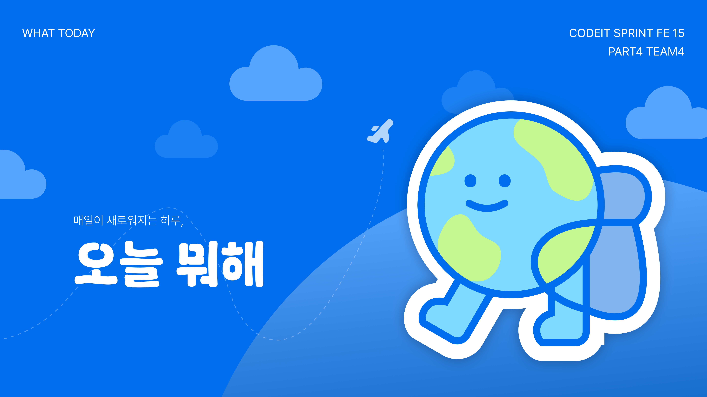](https://youtu.be/cIBeq3HQOyU)

> 포스터를 클릭하시면 시연 영상을 확인하실 수 있습니다.  
> 새 탭에서 열려면 **Ctrl + 클릭** (Mac: ⌘ + 클릭)

> 프로젝트 소개 글을 확인하고 싶다면?  
> [🌎 코드잇 블로그 - 오늘 뭐해](https://what-today-design-system.vercel.app/docs)

## '오늘 뭐해' 란?

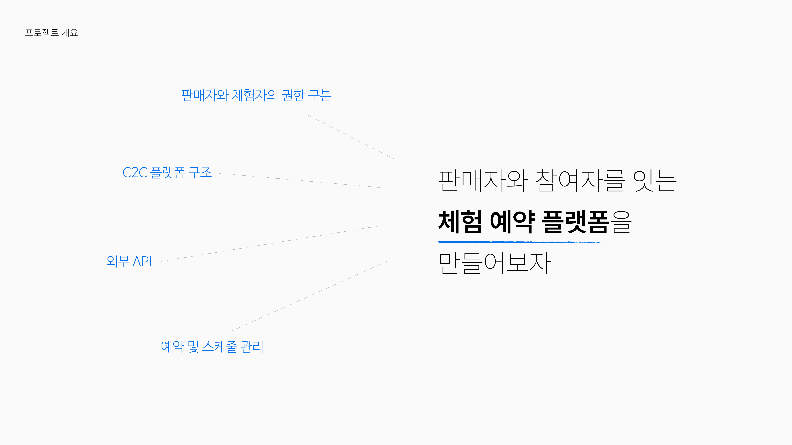
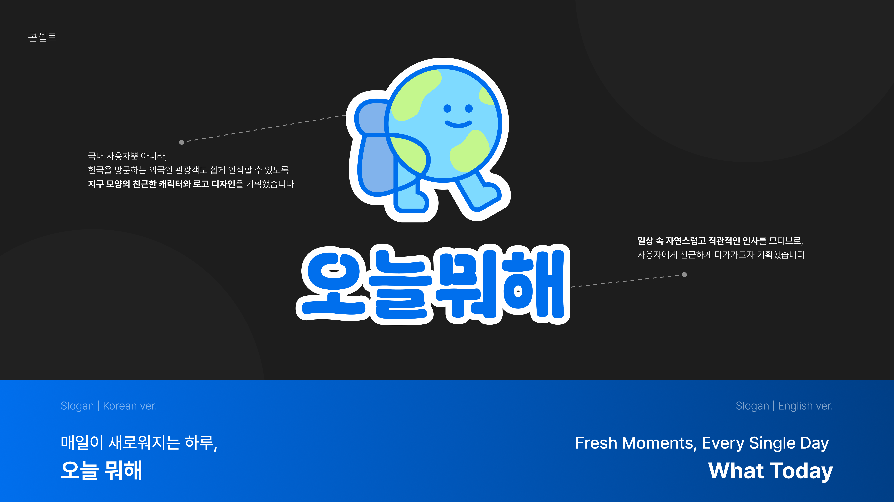

## 서비스 소개

오늘뭐해는 총 여섯 가지 주요 기능으로 구성되어 있습니다.

### 인기 체험 및 모든 체험

### 체험 등록 및 예약

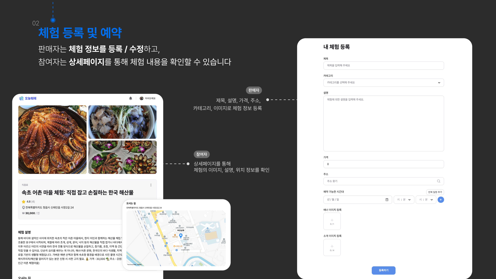

### 예약 및 일정 관리

### 리뷰 시스템

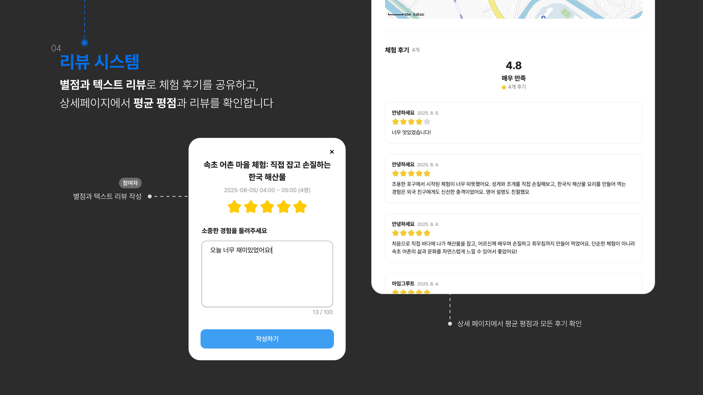

### 마이 페이지

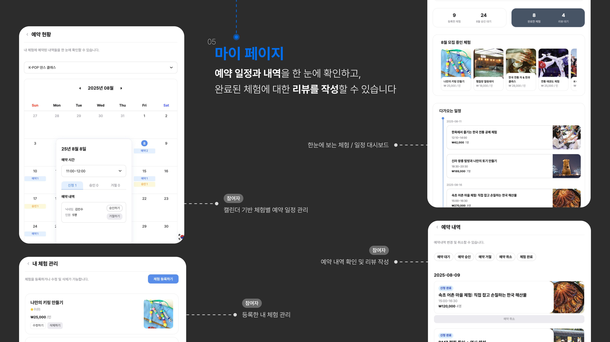

### 다국어 지원

## 디렉토리 구조

### 모노레포

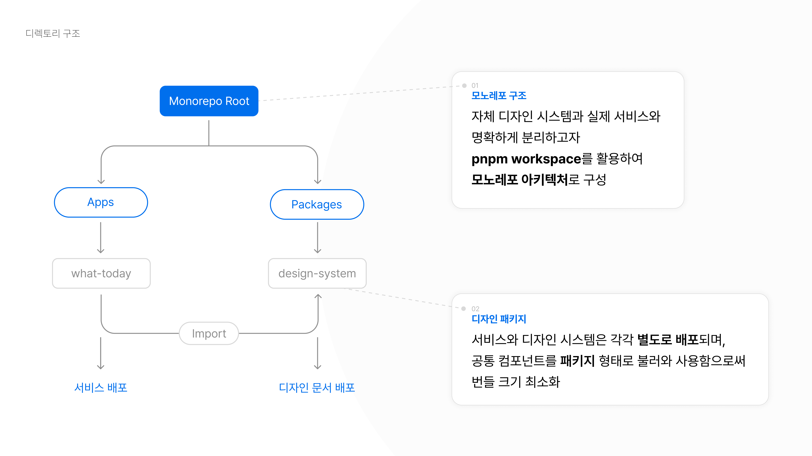

### 디자인 시스템 문서

> [🎨 디자인 시스템 바로가기](https://what-today-design-system.vercel.app/docs)

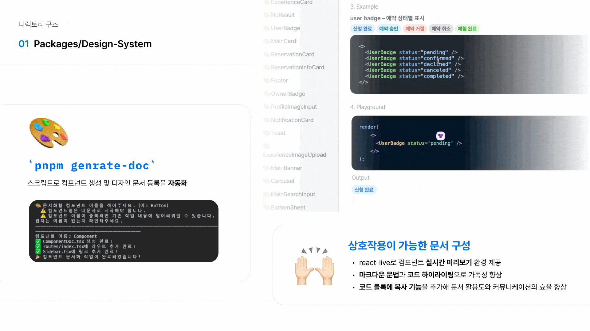

### 서비스

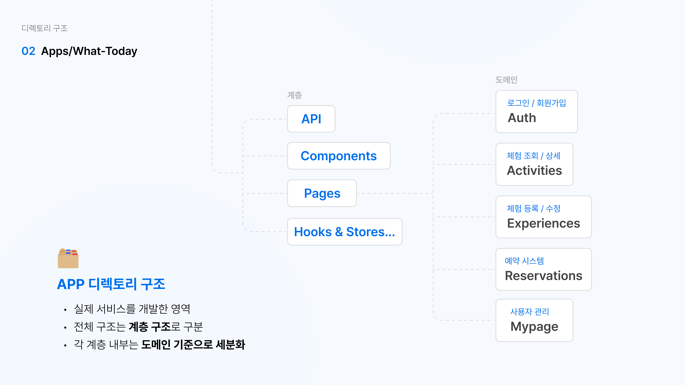

## 기술 스택

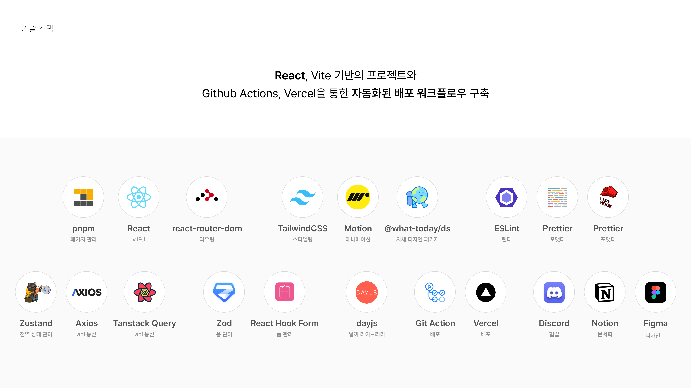

## 개발 일정

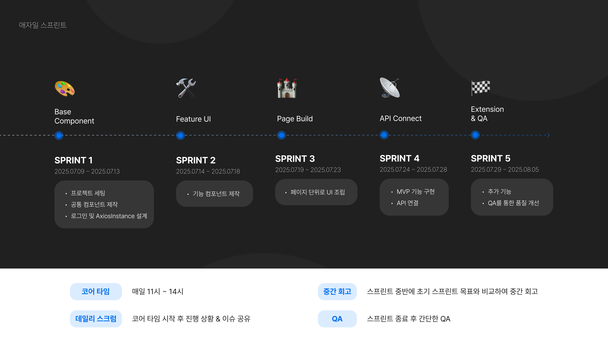

## 팀 구성

> 팀원 이미지를 클릭하면 각 팀원의 GitHub 프로필로 이동합니다.  
> 새 탭에서 열려면 **Ctrl + 클릭** (Mac: ⌘ + 클릭)

### 박지섭(팀장)

### 명지우

[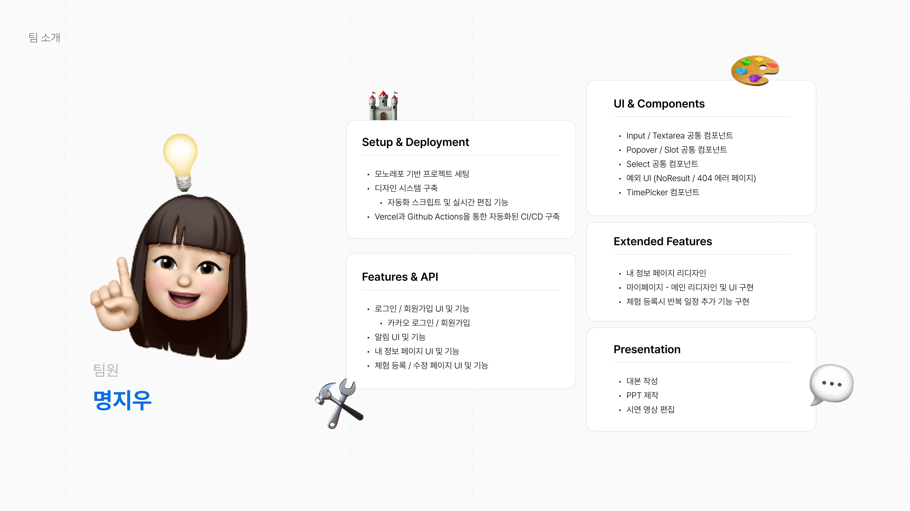](https://github.com/MyungJiwoo)

### 김지현

### 김태일

[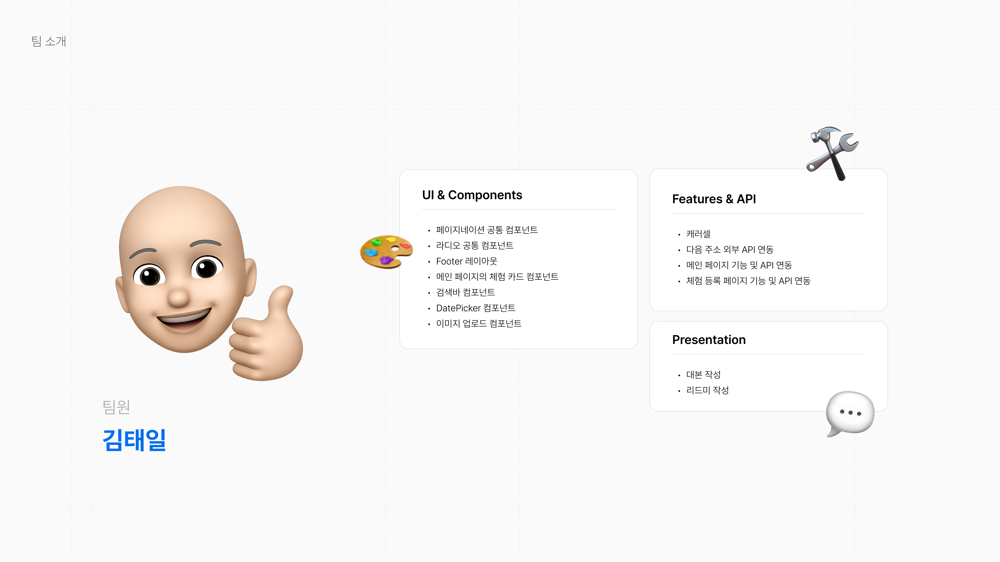](https://github.com/Taeil08)
